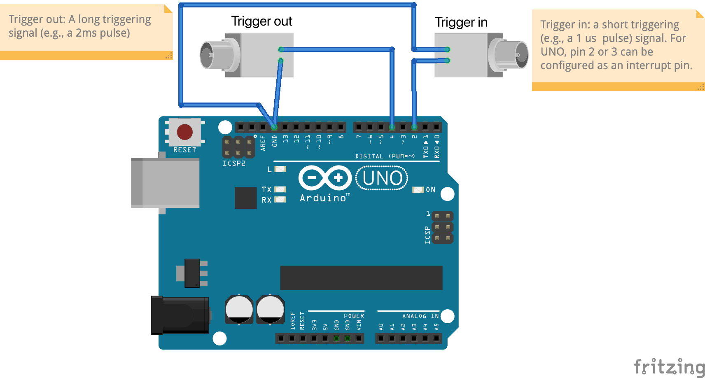

# arduino projects
Interesting and maybe useful arduino projects for fun and research
# Outline
1. [short trigger to long trigger](#short-trigger-to-long-trigger)
2. [flasing led](#flashing-led)
3. [trigger dispatcher](#trigger-dispatcher)

## short trigger to long trigger
Sometimes, you may need to record very short triggering pulses (e.g., 1 µs) as timestamps for offline data alignment. Due to Nyquist's Theorem, you will need a data acquisition (DAQ) card with a sampling rate of more than 2 MS/s, which can be expensive. An alternative solution is to convert the short pulses into longer pulses (e.g., 2 ms duration) so that you can record the signal with a more budget-friendly DAQ board with a sampling rate as low as 1 kHz. The code (/short_trigger_to_long_trigger) and following diagram illustrates how to convert a short trigger to a long one.

## flashing led
The LED at pin #4 will flash (i.e., turn on for a short time and then turn off) when the Arduino UNO receives an input trigger signal at interrupt pin #2. It can be used as a simple visual stimulation setup to generate visual evoked responses in rodents.

## trigger dispatcher
Scientific research or some tasks often necessitate the use of complex commercial equipment, some of which can only be activated through triggers. Consider a scenario where you have a PC and multiple external devices, such as a signal generator, data acquisition board, camera, and more. To successfully conduct an experiment, precise coordination among these devices is essential. For instance, you may need to commence signal recording and then play audio or video with an exact 20-millisecond delay. In such cases, a trigger dispatcher may be useful. It enables you to synchronize these devices in real-time, ensuring fixed timing and eliminating concerns about jitter. In this example, the trigger dispatcher is implemented using an Arduino, which receives commands from a PC via serial communcation.

